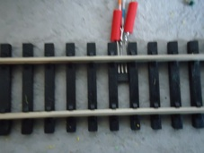
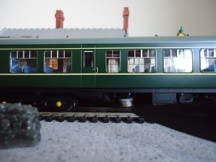

# Overview
I wondered if it was possible to get a Scratch program to control a model railway using a micro:bit to generate DCC messages. Well, maybe it is, but, my preliminary experiments proved unsuccessful and I wasn't able to obtain sufficient speed for the required pulse width for the bipolar signal.  While doing my initial research,however, I came  across an open source project called DccPlusPlus (also known as DCC++).  This is a truly amazing piece of software that  runs on the Arduino platform acting as a sophisticated DCC base station. Not only is the software brilliant, but the author, Greg Berman, has produced some really good documentation that includes a set of videos that, as well as explaining the implementation of a DCC++ Base Station, provides an easy to understand introduction to DCC. 

Scratch can't directly communicate with an Arduino, but can with a micro:bit, so,  I decided my project would be based on DCC++ and use the micro:bit to provide an interface between Scratch and the Arduino.  The Scratch / micro:bit extension uses an intermediary piece of software called [Scratch Link](https://scratch.mit.edu/microbit) which must be installed on the computer running a scratch program. Scratch Link requires a special program to be installed on the micro:bit which interacts with a set of Scratch blocks that make up the Scratch / micro:bit extension.

To make the Scratch / DCC++ interface as easy to install and use, I'm using the standard micro:bit extension, so, all you need to do is press the add extension button in the Scratch editor and add the micro:bit extension. This makes available a set of blocks (green) that communicates with the micro:bit allowing a limited number of functions such as detecting when buttons are pressed and displaying text on the micro:bit's LED matrix. To enable the extension to communicate with DCC++ running on the Arduino, I've written an alternative program to the standard one provided with the Scratch / micro:bit extension.

The alternative program (Scratch-Train.hex) takes commands sent using the 'display text' and 'display' blocks and sends them to the Arduino running the DCC++ software.  It can also feed information from DCC++, such as sensor activations, and trigger the event blocks 'when button pressed' and 'when pin connected'.

By incorporating these blocks into your Scratch program, you can write customised train controllers and scripts to automate model railways.  

*Figure 1 Block Diagram of the Scratch DCC++ interface*

Figure 1 shows the main components of the Scratch DCC++ interface. When you add the micro:bit extension to your Scratch program it will check that the  [Scratch Link](https://scratch.mit.edu/microbit)  program is installed. Scratch Link will look for micro:bits that are advertising the Bluetooth Scratch service. If an appropriately configured micro:bit is discovered, you will be able to connect to it and communicate using the micro:bit blocks. The micro:bit program will interpret the instructions sent from Scratch and build the appropriate [DCC++ commands](https://github.com/DccPlusPlus/BaseStation/wiki/Commands-for-DCCpp-BaseStation) and send them to the the DCC++ program running on the Arduino. Additionally, track sensor data interpreted by DCC++ is relayed to Scratch via the micro:bit.

# DCC++
Scratch-Train requires DCC++ to be installed on a Arduino Uno micro computer connected to an appropriate motor shield. I recommend viewing the following brilliant YouTube videos:

The first video provides a background to [DCC](https://www.nmra.org/index-nmra-standards-and-recommended-practices) provides and introduction to DCC  and delves into the DCC signal protocol.

[An Arduino DCC++ Base Station - Part 1 of 4](https://youtu.be/-nsVdpMhiTU)

The second video goes into more detail on how the Arduino hardware can produce dcc signals.

[An Arduino DCC++ Base Station - Part 2 of 4](https://youtu.be/rX05axpgROk)

The third video describes the DCC bipolar signals and how they are produced using the Arduino motor shield.

[An Arduino DCC++ Base Station - Part 3 of 4](https://youtu.be/6BRvv45db9o )

The final video in the series deals describes how the Arduino Uno board, the motor shield and the power supply come together to make the DCC++ base station. In particular it describes the modification that needs to be made to the motor shield to allow it to handle voltages greater than 12 volts.

[An Arduino DCC++ Base Station - Part 4 of 4](https://youtu.be/8cBQoI1NfHI)

To complete the DCC++ base station you will need to download the [DCC++ program](https://github.com/DccPlusPlus/BaseStation) and install it on the Arduino Uno. If you are new to the Arduino platform you will need to install the [Arduino IDE](https://www.arduino.cc/en/Main/Software) on your computer.
# micro:bit
The [micro:bit](http://microbit.org/guide/) is an amazing bit of kit for those of you who like building electronic gadgets.
It's ability to use Bluetooth Low Energy, it's ease to program and connect external components, makes the micro:bit an ideal and cheap way to build interfaces.

The micro:bit communicates with Scratch Link over Bluetooth low energy. The messages sent using the Scratch 'display' and 'display text' blocks are converted to DCC++ commands and sent to the Arduino using a serial communication link.

A small problem occurs because the Arduino Uno operates at 5 volt logic levels  and the micro:bit at 3 volt. This is easily resolved using a Logic Level Converter that takes the the 3 volt outputs from the micro:bit and converts them to 5 volt inputs to the Uno and vice versa.

# Track sensors

Scratch-Train is capable of detecting when a train passes over a sensor. A maximum of 5 sensors can be connected. This is because the Scratch program uses the micro:bit extension blocks  **'when pin connected'** (3 possible states thus 3 sensors) and **'when button pressed'**(2 possible states thus 2 sensors). 

DCC++ has a clever algorithm for detecting when a sensor is activated and avoiding "de-bounce" spikes generated by mechanical switches and transistors. In my prototype I'm using "hall-effect" devices that are activated when a magnet passes over them.

The hall-effect switch is a small device that fits on the railway track. The A1121LUA -T is just the right size to fit between the sleepers of a OO guage track.

*The hall-effect switch fitted between the sleepers*

The flat side of the device should be facing upwards towards the underside of the train. Care must be taken to ensure the three leads that protrude from the device do not touch each other or the metal rail.

For detailed information of the device see the [device data sheet](http://www.allegromicro.com/en/Products/Magnetic-Digital-Position-Sensor-ICs/Hall-Effect-Unipolar-Switches/~/media/Files/Datasheets/A112x-Datasheet.ashx) 

The switch is activated when the south-pole of a magnet passes over the hall-effect device.

*Picture showing a magnet located beneath the train secured with Blutack*

# Construction

*Figure 2 Prototype*

Figure 2 shows a prototype of the interface consisting of: 

- micro:bit (mounted on an edge connector from [Kitronik](https://www.kitronik.co.uk/microbit/bbc-micro-bit-accessories.html))
-  suitable Logic Level Converter  (I'm using a TXS0108E  available on Amazon )
- Arduino Uno Board R3
- Arduino Motor Shield R3 (i'm using the Deek Robot (diymore) L298P Shield Expansion Board DC Motor Driver Module 2A H-Bridge 2 way For Arduino UNO R3 Mega2560 ) available on Amazon)

You will require a suitable power supply (or power supplies). The DCC++ videos recommend a 15 volt DC regulated power supply to power the trains, although I'm using a 13.8 volt supply without any problems. Obviously, the supply must be of sufficient current to power the model railway. Additionally, the Arduino Uno will require a 5 volt supply as will the micro:bit. The micro:bit has a number options for it's power, for the prototype I've chosen to power both Arduino and micro:bit through their respective USB connections using 5 volts.

*Figure 3 Arduino / micro:bit hookup*

Figure 3 shows how the Arduino and the micro:bit are connected via the TXS0108E logic level converter.. The diagram shows the Arduino motor shield. It is assumed the motor shield is mounted on top of the Arduino Uno as explained in the DCC++ videos. 

*Figure 4 Connecting Hall Effect Sensors*

Figure 4 shows how Hall-effect sensors can be connected to the Arduino. Sensors have been connected to pins 6 and 7. Additional sensors (maximum of 5 as explained above) could be connected to available pins (e.g. 2,3,4). The sensors will have to be configured in the DCC++ program as explained under the **Sensors** section of the [DCC++ commands](https://github.com/DccPlusPlus/BaseStation/wiki/Commands-for-DCCpp-BaseStation) document.

# micro:bit software

The Scratch micro:bit extension usually requires a special program(scratch-microbit-1.1.0.hex) to be downloaded onto the micro:bit, however, to use Scratch Train, this program must be replaced.  Using the web browser on your computer, download: [https://phwallen.github.io/Microbit-Explorer.hex ](https://phwallen.github.io/Microbit-Explorer.hex).

Scratch-Train is a program written in C++ that runs on the micro:bit. It communicates with Scratch Link using Bluetooth Low Energy (BLE).  Once downloaded the program will display **S** on the LED matrix of the micro:bit and advertise BLE service 'F005'.  This is the service used by Scratch Link and when in range of the micro:bit, will display a **Connect** button.

Once connected, the micro:bit will display **C** indicating that messages can be sent and received between your Scratch program and DCC++.

If the micro:bit looses connection with Scratch Link it will display **D**  and reconnection will be necessary.

The interface uses the following micro:bit extension (green) blocks :

- **display text** is used to send valid [DCC++ commands](https://github.com/DccPlusPlus/BaseStation/wiki/Commands-for-DCCpp-BaseStation)  e.g. &lt;t 1 3 20 1&gt;
- **display** is used to send Scratch train commands ( see Table 1 below)
- **when A/B button pressed** detect if the A or B button is pressed and when DCC++ detects a Sensor is activated (sensor &lt;Q4&gt; = A button , sensor &lt;Q5&gt; = B button) . 
- **A/B button pressed?"**
- **when pin 0/1/2 connected** when DCC++ detects: &lt;Q1 = pin 0&gt;  &lt;Q2 = pin 1&gt; &lt;Q3 = pin 2&gt;

The remaining extension blocks are undefined.

## Scratch Train Commands
A problem can arise when sending DCC++ commands using the **display text** block. **display text** will block the Scratch program until it believes enough time has passed to scroll the text across the micro:bit LED matrix. The delay is based on a notional value of about 1 second per character in the text. Hence the command to move a train forward &lt;t 1 3 20 1&gt; would block the program for about 12 seconds. Consequently, a subsequent command (perhaps an important one like stop the train) would not be able to execute for 12 seconds, possibly with catastrophic results for the train!

The solution is to use the **display** block, which does not delay,  to send a single DCC++ command. The **display** block is designed to send an image to the micro:bit's LED matrix. This is made from a pattern of 5 x 5 values each value being on or off i.e. a 25 bit pattern.  

Only the first 3 rows are used to make a command that consists of a maximum of 3 parameters. Each parameter is 5 bits (decimal value 0 - 31) long. 

- parameter 1 command 
- parameter 2 address 
- parameter 3 speed  (only required for throttle commands 1 & 2). Note the speed parameter is multiplied by 4 when converted to the DCC++ command. e.g. 10100 = a speed of 20 (5 x 4).

N.B. the decimal values for each parameter are determine by a bit pattern where the left hand bit represents the least significant bit. e.g. 10000 = 1 and 00001 = 16

The following table shows a list of commands that can be used with the **display** block:

Command|Bit Pattern | Operation | DCC++ Command
------------|-------------- | ---------- | ---------------------
0|00000 | Stop Train       | &lt;t 1 [address] 0 0>
1|10000 | Forward Train | &lt;t 1 [address] [speed] 1> 
2|01000 | Reverse Train | &lt;t 1 [address] [speed] 0>
3|11000 | Accessory Deactivate | &lt;a [address] 0 0>
4|00100|  Accessory Activate | &lt;a [address] 0 1>
5|10100| Cab Function F0 ON|&lt;f [address] [function code]>
6|01100| Cab Function F0 OFF|&lt;f [address] [function code]>
7|11100| Cab Function F1 ON|&lt;f [address] [function code]>
8|00010| Cab Function F1 OFF|&lt;f [address] [function code]>
9|10010| Cab Function F2 ON|&lt;f [address] [function code
10|01010| Cab Function F2 OFF|&lt;f [address] [function code]>
11|11010| Cab Function F3 ON|&lt;f [address] [function code]>
12|00110| Cab Function F3 OFF|&lt;f [address] [function code]>
13|10110| Cab Function F4 ON|&lt;f [address] [function code]>
14|01110| Cab Function F4 OFF|&lt;f [address] [function code]>
15|11110| Cab Function F5 ON|&lt;f [address] [function code]>
16|00001| Cab Function F5 OFF|&lt;f [address] [function code]>
17|10001| Cab Function F6 ON|&lt;f [address] [function code]>
18|01001| Cab Function F6 OFF|&lt;f [address] [function code]>
19|11001| Cab Function F7 ON|&lt;f [address] [function code]>
20|00101| Cab Function F7 OFF|&lt;f [address] [function code]>
21|10101| Cab Function F8 ON|&lt;f [address] [function code]>
22|01101| Cab Function F8 OFF|&lt;f [address] [function code]>
23|11101| Cab Function F9 ON|&lt;f [address] [function code]>
24|00011| Cab Function F9 OFF|&lt;f [address] [function code]>
25|10011| Cab Function F10 ON|&lt;f [address] [function code]>
26|01011| Cab Function F10 OFF|&lt;f [address] [function code]>
27|11011| Cab Function F11 ON|&lt;f [address] [function code]>
28|00111| Cab Function F11 OFF|&lt;f [address] [function code]>
29|10111| Cab Function F12 ON|&lt;f [address] [function code]>
30|01111| Cab Function F12 OFF|&lt;f [address] [function code]>
31|11111| reserved|

*Table 1 commands available using the display block*

The above table only represents a limited number of DCC++ commands. Certain commands will still require the use of the **display text** block. For example: Turn power off &lt;0&gt; and Turn power on &lt;1&gt; Also, specialist commands such as programming the sensors should be done with **display text**.

## Scratch custom blocks

It is recommended that **display text** and **display** commands are wrapped in a **My  Blocks** wrapper.

*Figure 5 Scratch My Blocks Emergency Stop*

For example, Figure 5 shows the DCC++ command: **power off** being wrapped in a custom block called Emergency Stop.

The use of the **display** block to send a command makes it more important to use a My Blocks wrapper. 

*Figure 6  Example of using a display block to send a command*

Figure 6 shows the bit pattern to send the DCC++ command &lt;t 1 3 12 1&gt; (throttle address=3 speed=12 forward).
Using Table 1 (see above), you can see the 3 rows of the bit pattern are:

-  10000  command 1 Forward Train
-  11000 address 3
-  11000 speed 12 (remember the binary value i.e. 3 is multiplied by 4)

To make such a command easier to use, it's recommended that it's wrapped in a My Block that includes a routine to create the bit patterns from more readable parameters.

*Figure 7 Example of a wrapper for a Forward command*

Figure 7 is an example of a My Block called Forward which takes 2 integer parameters - address and speed. As you can see it uses a function, another My Block, called  intToBin, to convert the 2 integer values to the appropriate bit patterns. 

*Figure 8 Scratch My Block intToBin*

Figure 8 shows an example of a function that is used in Forward block described in Figure 7 to create a binary bit pattern from an integer.
